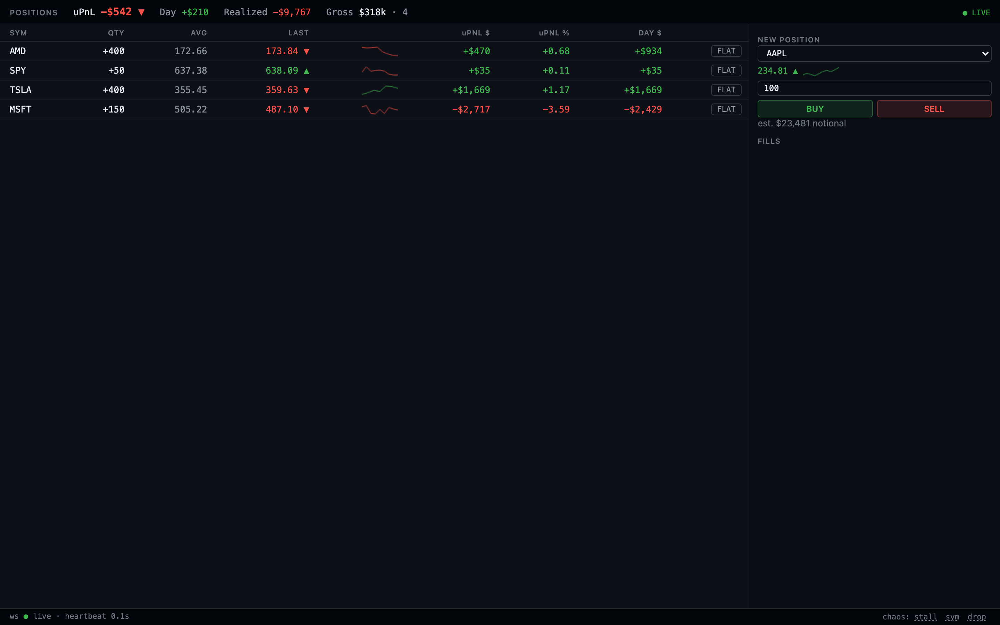

# Live Position Monitor

## What

A single-screen live position monitor for a trader watching a book of US-equity positions tick
in real time, with the ability to enter and exit market-order positions without leaving the
screen. The feed and fills are mocked by a small Rust backend. The frontend is what's being judged:
trader-grade UX, honest rendering of live data, and a UI that stays legible under stress — bursty
ticks, dropped connections, stale prices.



Two accompanying writeups:

- [**UX & design rationale**](docs/ux-design.md): the read hierarchy, the color and motion budgets,
  how the screen behaves when the data can't be trusted, and the layout I rejected.
- [**Agent proposal**](docs/agent-proposal.md): a position-summary agent for the monitor. Workflow,
  architecture, and the decisions I'm least sure about.

## Run

**Docker (recommended for review):**

```
docker compose up
```

Open `http://localhost:8080`. One image, one container. The frontend is built and served as static
files by the same binary that runs the feed and the API.

**Dev mode (hot reload):**

```
cd server && cargo run        # :8080
cd web && npm run dev         # :5173, proxies /api and /ws to :8080
```

Open `http://localhost:5173`.

Either way, the screen comes up live: ~6 seeded long/short positions ticking, an account strip
totaling PnL, a ticket for new orders, and a status footer. The footer's chaos buttons (dev-only)
let you demo the failure modes directly: **stall** freezes the whole feed and heartbeat, **symbol
stall** freezes one row, **drop** kills the socket. Each auto-restores after a few seconds, so you can
watch degrade → stale → reconnect → live happen live.

## Architecture & the FE/BE boundary

A Rust binary serves the built frontend, a REST API under `/api`, and a WebSocket at `/ws`.
All state lives in memory (since its just mock data) which means there is no persistence.
The frontend is Vite + React + TypeScript + Zustand.

The REST/WS split is as follows:

- **Commands go over REST.** Placing an order and closing a position are HTTP requests with
  status codes: accepted, rejected, or not-found.
  Mapping these onto HTTP makes error handling easier and gives the client something to await.
- **Events go over the WebSocket.** Price ticks, fills, and position updates are the server
  telling the client something happened in real-time.

The server owns _truth_: prices, positions, fills, realized PnL. The client owns _derivation_:
unrealized PnL, aggregates, formatting, staleness.
None of that is computed on the backend. Keeping derived values out of the payload means
there's exactly one source of truth to deal with on reconnect, and no risk of the client's derived numbers
mismatching the state of the server.

### WS contract (server → client, JSON, tagged by `type`)

| type        | payload                                                                                               | cadence                                       |
| ----------- | ----------------------------------------------------------------------------------------------------- | --------------------------------------------- |
| `snapshot`  | `seq`, symbols (`sym`, `prev_close`), prices (`sym`, `px`, `ts`), positions, account `{realized_pnl}` | on every (re)connect                          |
| `ticks`     | `seq`, `ticks` (`sym`, `px`, `ts`)                                                                    | 50ms conflated batches (~20Hz aggregate feed) |
| `fill`      | `order_id`, `sym`, `side`, `qty`, `px`, `ts`, `status`                                                | on execution                                  |
| `position`  | updated position (`sym`, `qty`, `avg_px`, `opened_at`) or close marker, plus account `{realized_pnl}` | after fills                                   |
| `heartbeat` | server `ts`, `seq`                                                                                    | every 1s                                      |

A position's `qty` is signed to indicate short or long.

### REST

- `POST /api/orders {symbol, side, qty}` — `202 {order_id, status: "accepted"}`: the fill itself
  arrives later over WS.
- `POST /api/positions/{symbol}/close` — `202`: flattens whatever quantity the server currently
  holds at the moment the write applies, not whatever quantity the client last saw. That matters
  under concurrency: two close clicks racing each other (double-click, or a stale UI retry) both
  read the position under the same write lock that applies the close, so the second one sees
  "already flat" instead of flipping the position to the opposite side. `404 {"error": "flat"}`
  if the symbol has no open position at request time.
- `GET /api/positions`, `GET /api/symbols`: plain reads for scripting or other non-UI
  consumers. The trading screen itself never calls either. It bootstraps entirely from the WS
  `snapshot` message and has no REST-fallback path.
- `POST /api/chaos {mode: "stall" | "symbol_stall" | "drop", duration_ms, symbol?}` — dev-only
  demo control to show reconnects and staleness handling.

## Design decisions

**Conflation.** The mock feed runs at roughly 20Hz aggregate across all
symbols. The server batches raw ticks into 50ms windows before broadcasting; the client further
coalesces incoming messages into a single Zustand commit per animation frame (~100ms, rAF-aligned,
latest tick per symbol wins). The result is one row re-render per visible update. The feed stays
pretty fast without asking React to keep up with all the live events.

**A tight motion budget.** Flashing cells at feed rate is how you make numbers unreadable. The LAST
price column recolors and shows a direction arrow on each tick. No flash. Row background gets a
single one-second pulse only on an actual fill or position change, so a flash always means "something
happened to your position," never "a price moved." PnL cells only recolor. Everything renders at the
same conflated ~10fps the data arrives at.

**Orders stay pending until the server confirms.** Submitting an order or a close doesn't touch position or PnL state
until the server confirms it. An order sits as `pending` (shown with a ⧗) from the `202` ack
until the WS `fill` lands; a `422` surfaces as a coded error inline in the ticket, and a failed close
lands as a rejected entry in the fills rail; if nothing arrives within 5 seconds the order flips to
an explicit "unknown: check positions" state
instead of silently assuming success or failure. Nothing on the money path gets rendered before
the server says it happened.

**The flatten button arms before it fires.** Clicking a row's FLAT doesn't close the position. It
arms the button, which relabels itself to show the exact consequence: `CONFIRM −200 @ MKT`, not a
generic "are you sure?". A second click fires it. The arm auto-disarms after 3 seconds or on Esc, and
arming one row disarms any other. The server-side quantity cap does the same job on order entry. The
rule in both places is to block it or show the exact number.

## Tradeoffs

- **`f64` for money.** Fine for a mock feed with no persistence and no audit trail; a real trading
  system would use fixed-point or integer cents to avoid floating-point drift in PnL math.
- **In-memory state only.** Nothing survives a restart: no database, no write-ahead log, no crash
  recovery. Acceptable for a demo, not for anything with money actually at stake.
- **No auth, single account.** One trader, one session, no login.
- **Market orders only.** No limit orders, no working/cancelable orders, no partial closes. A close
  always flattens the full position.

## Testing

- **`server/`**, 18 tests: position math (avg-cost re-averaging, realized PnL on reduce / close
  / flip, short-side signs), order validation (all three 422 codes), an end-to-end integration
  test through the real HTTP + WS stack (snapshot arrives first, then ticks, then a heartbeat),
  and a concurrency test that fires two closes at the same position simultaneously and asserts
  the second is a no-op rather than flipping to a short/long on the other side.
- **`web/`**, 43 tests: the tick-conflation buffer, PnL/day-baseline selectors, the number
  formatters, blotter rendering, the connection state machine under fake timers (live → degraded →
  stale → reconnecting → live), the order ticket and fills rail, the arm → confirm → pending →
  filled flatten interaction end to end, and an app-level smoke test that boots the real component
  tree, applies a snapshot, and pushes a tick flush through it.

Commands:

```
cd server && cargo fmt --check && cargo clippy --all-targets -- -D warnings && cargo test
cd web && npx tsc -b && npx vitest run
```

## With another day

Limit orders and partial closes; a cancel flow for working orders; keyboard-first order entry;
Playwright end-to-end coverage on top of the current unit/integration layer; a CVD-safe palette
toggle; configurable blotter columns; persisted UI settings (column widths, palette); multi-account
support.

Two smaller ones I left out on purpose, not for lack of time:

- **Symbol chips in place of the ticket's dropdown.** One click to any of the eight tradeable names
  instead of a select, without putting non-position rows into the blotter and diluting the read it
  exists for.
- **Quantity preset buttons.** Set, not increment: a preset writes a visible number into the quantity
  field for the trader to check before committing, so there's no click-count ambiguity on the money
  path.
