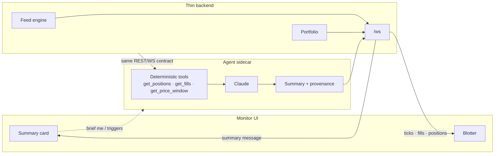

# Agent Proposal: "Brief me"

## What

A position-summary agent rendered as a card in the monitor's right rail. The trader presses **Brief
me** and gets four lines: what the day's PnL has been doing, where exposure is concentrated, what is
driving the move, and whether anything looks unusual.

There is no input box (though that could be a later feature addition).
Its value over the blotter is synthesis across time and rows. The table shows current values, and the card shows
the trajectory behind them and the relationship between rows.

## Why

Every large broker shipped something adjacent in the past eighteen months. Robinhood's Cortex
digests (2025) and Public's Alpha explain why a stock moved, built from news and indicators. Ask
IBKR (October 2025) answers questions about account state in chat, and BlackRock's Aladdin Copilot
does the same for institutional books.

The closest thing to this proposal is Schwab's portfolio insights card (May 2026):
daily PnL movement on the account's top movers plus related news, rendered as a card
on the account page.

There are two major gaps in most of these products. Because the existing solutions summarize news
about holdings rather than the book itself, and almost none enforce a hard line between computed
figures and generated prose, they introduce hallucination.

Schwab ships a disclaimer saying the output may contain hallucinated numbers and directs users to their account statement.
Bloomberg's ASKB is the exception: it surfaces the query behind each answer. This proposal takes the Schwab
form factor and the Bloomberg guardrail and applies them to a single trading screen.

## Workflow

1. **Invocation.** The trader clicks **Brief me**, or a trigger fires: day PnL crossing a drawdown
   threshold, concentration breaching a configured share of gross, or unusual velocity in a symbol.
2. **Snapshot.** The agent service reads state through the browser's own REST/WS contract:
   `GET /api/positions`, `GET /api/symbols`, and the price/fill stream off `/ws`.
3. **Deterministic pre-compute.** A tools layer derives every figure the card can contain: day
   trajectory, concentration, largest contributor with attribution, realized/unrealized split, fill
   and rejection counts, staleness. Ordinary arithmetic, in code, unit-tested.
4. **Selection and phrasing.** Claude gets those facts as JSON plus a system prompt fixing the card's
   shape: four lines, priority order, house style, prohibitions. It picks three or four of ~20 facts
   and writes them as English, and never calculates.
5. **Delivery.** The summary streams back over the existing WebSocket as a `summary` message.
6. **Render and expire.** The card carries a data-age stamp and dims after 60 seconds — the blotter's
   own language for stale — because a minute-old summary of a live book is already suspect.

## Architecture



**Where it runs.** An workflow like this is best deployed as a sidecar beside the backend.
If you put it in the browser, you'd probably end up with a leaky API key.
It shouldn't go in the main backend either, where a two-second model call could backpressure a tick loop that owes
the screen an update every 50 ms.

The cost of doing this is a second process to deploy, monitor, and version alongside the backend.
It reads the same endpoints and socket the UI does, so it can never see state the screen can't.
In production only the tools layer changes: `get_positions` fans out to the real OMS, `get_fills` to the execution store,
while the model's contract stays identical.

**A hallucinated number cannot reach the screen.** Figures come from the tools layer and are rendered
by the card template, with the model's text interpolated around them. Anything citing a number outside
the computed set drops the card to its template-only variant.

Making it feel responsive means staying within some sane latency budgets.
I would propose a skeleton view on click, deterministic figures under 300 ms, explanations streaming over
1–2 s, template-only settle past 3 s.

300 ms is a pretty good budget that straddles the line between being too fast to be thorough and too slow.
The tools layer is one snapshot read plus arithmetic, so it should clear it easily. Even a total model outage leaves a
factual card on screen (after 3 s).

## What a good summary says

```
BRIEF  14:52:38            data 0.3s old
+$210 on the day, on top of −$9,767 already realized — the day column is not the session.
TSLA is 45% of $318k gross and two-thirds of the day's gains. Concentration is the risk here.
MSFT is the drag: −$2,717 unrealized, −3.59%, and no bid above its 14:31 level since.
Nothing rejected, no stale symbols, fill latency normal.
```

Each line does something the blotter can't: relate two figures the strip shows separately, express a
cross-row relationship, attribute the drag to a name and a time. Line four is there so its absence
means something.

**What it never does:** no advice; deciding is the trader's job. No predictions. No restating
a number already legible on screen, except as an anchor. Nothing older than its stamp: when data is
stale the card says so and the model gets less to work with.

## The decisions I'm least sure about

- **Push versus pull.** Pull only fires when the trader already suspects something; push catches what
  they missed, at the risk of alert fatigue. Ship pull-only and instrument the triggers silently to
  count how often they would have fired.
- **Whether prose beats a deterministic card.** At a handful of positions a static panel might carry
  the same information at zero latency and cost — honestly, at six positions I'd bet on the panel.
  A/B the two above twenty, where choosing which facts matter is the hard part.
- **Reusing the WebSocket.** It keeps one channel of truth but couples agent availability to feed
  plumbing. Ship on the WS, split to an SSE channel the moment summary traffic shows in tick latency.
- **Model tier versus latency.** A larger model prioritizes and phrases better; a smaller one halves
  time to first token. The first session where the card feels slower than the screen it summarizes
  would settle this one.
