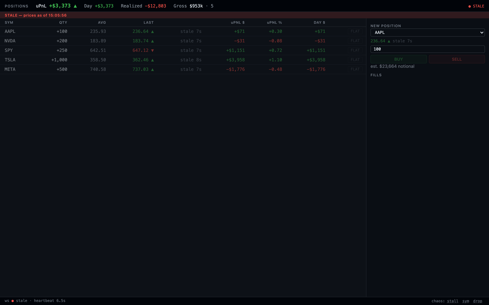
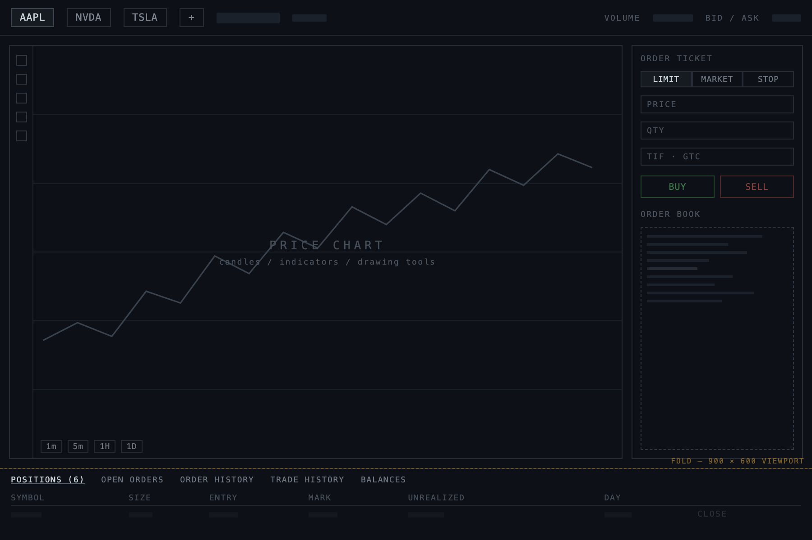

# UX & Design Rationale

A trader leaves this screen open for eight hours and glances at it hundreds of times, usually while
doing something else. Almost every decision below follows from that. The screen has to answer a
question in about a second, from peripheral vision, and it has to be honest when it can't answer at
all.

_The monitor in its resting state. The account strip carries the only large type on the screen, the
blotter's color is confined to two columns, and everything structural stays quiet: labels, averages,
hairlines._

## The one-second read

There is a fixed eye path, and the visual weight is allocated to enforce it.

1. **"Am I OK?"** The strip's **uPnL** is the largest, boldest, highest-contrast element on the
   screen, and it is the only one. It sits top-left, first in the reading order, with the day figure,
   realized, and gross exposure beside it at normal weight.
2. **"Where is it coming from?"** The **uPNL $** column. It is the only place in the blotter where
   large signed numbers carry color mass, so a red block partway down the table is findable without
   reading a single digit. The eye lands on the color, then reads the symbol next to it.
3. **"What's moving right now?"** The **LAST** column's arrows and tick color. This is the only part
   of the screen that changes continuously, so it is the only part that should attract the eye
   through motion.

Everything else is intentionally quieter. AVG is muted gray because it is a reference value, not
news. Column headers are dim and small. Row separators are hairlines at half the border color, which
guides a horizontal read without drawing one. All numerics are tabular-figure monospace and
right-aligned, so digits sit in fixed columns and a price changing from `99.98` to `100.02` doesn't
shift the row. Sparklines are 52×14 px of 60-second history: enough to answer "is this a trend or a
blip" in peripheral vision, small enough to read as texture beside the PnL columns.

## Stable geometry

Rows never re-sort, columns never resize, and nothing reflows when values change. Position order
comes from the server snapshot and stays put; new positions append at the bottom. This is a deliberate refusal of a feature people ask for. A trader who has watched the
same book all morning knows MSFT is the fourth row. That spatial index is faster than reading, and
it is destroyed the instant the table re-sorts under a moving value. The industry litigated this point
for a decade over the static price ladder, and the reasoning holds here: a number that stays where
you left it can be read with peripheral vision, while a number that moves has to be found first, and
finding costs a fixation you may not have.

## Color, rationed

Color is a scarce resource on this screen, spent only where it means something. Green and red are
reserved for direction and signed PnL, amber for a degraded feed, and gray does everything
structural at three levels of emphasis. Nothing else gets any.

Backgrounds stay near-black, and every color on screen carries information. Every signed value ships
with an explicit `+`/`−`, and every direction ships with a `▲`/`▼`. Red-green color deficiency affects roughly one in
twelve men, which is an unusually high base rate in this particular user population, and a screen that
encodes profit and loss in hue alone is unreadable to them. With the sign and the arrow present, the
color is redundant encoding.

## The motion budget

LAST recolors and shows an arrow on each tick, and it does not flash. A background flash at feed rate
is a strobe, and a strobing cell is an unreadable cell. Row background pulse is reserved for position
changes: a fill, an add, a close. One one-second fade, and it means precisely one thing: something
happened to your position. Because it is never spent on price movement, a flash in the corner of the
eye is always worth turning to look at. PnL cells only recolor.

Everything renders at the same conflated rate the data arrives at. The server batches ticks into
50 ms windows, the client coalesces to one commit per animation frame, and the screen updates roughly
ten times a second. That sits at the upper end of what a human reads as continuous motion and well
under what makes numbers blur.

## When the data can't be trusted

The failure mode that actually hurts a trader is a screen that keeps looking fine while showing a
price from forty seconds ago. So staleness is a first-class rendering state here, driven by a 1 Hz
heartbeat rather than by socket state alone.

_The screen under a feed stall. Prices dim to 45%, sparklines give way to their own age (`stale 7s`)
in the blotter and in the ticket alike, the banner stamps the wall-clock time the data is actually
from, and every action is disabled. The layout does not move._

Past 2.5 s without a heartbeat the screen goes **degraded**, with an amber banner reading "last data
Ns ago". Past 6 s it goes **stale**: red, stamped with the clock time the prices are from. Individual
symbols stale independently after 3 s without a tick, so one frozen instrument dims its own row while
the rest keep ticking. Actions disable, they don't disappear: FLAT grays out and stops responding
when its row is stale or the connection isn't live. Hiding a control would change the layout under a
trader mid-reach and leave them wondering where it went. Disabling it says the button is there and
the data isn't.

**Nothing on the money path is optimistic.** A submitted order shows `⧗ pending` until the server
sends the fill, a rejection surfaces as a coded error, and if nothing arrives within five seconds the
order flips to an explicit unknown state.

**Staleness outranks direction.** When a price goes stale its whole cell dims, tick color included. A
frozen price still wearing a bright green up-arrow is the most dangerous thing this screen could
draw, because it looks more live than a moving price: color reads as recency before it reads as
direction. The ticket's quote line follows the same rule and dims wholesale.

## The ticket

The order ticket lives in the right rail and carries a live quote line for whichever symbol is
selected: last price, direction arrow, and the same 60-second sparkline the blotter uses,
dimming to its own age stamp when that symbol goes stale. Sizing a new position needs price context,
and the row it will become doesn't exist yet, so the context belongs in the ticket. That keeps the
blotter strictly about positions while still letting an entry decision happen without looking at
another window. Underneath the buttons sits the estimated notional, the other half of the fat-finger
story. A share count is abstract. A dollar figure is not, and it updates as the quantity is typed
rather than after the order is sent.

Clicking a row's SYM cell seeds the ticket with that symbol. Trade-from-blotter context seeding is
the one convention every platform I looked at implements in some form, and it is why the blotter and
the ticket read as a single surface. The entry path now matches the exit path in directness: adding
to or trimming an existing position is click the row, then BUY or SELL, with no typing and no symbol
hunt in between.

## Speed versus fat-finger

Closing a position has to be one motion, and it must not be possible to do by accident. A modal
confirm dialog fails both: it is slow, and it trains people to click through it.

The FLAT button arms instead. The first click turns it red and relabels it with the actual
consequence, `CONFIRM −200 @ MKT` rather than "Are you sure?", so what gets confirmed is the specific
trade. The second click fires. It auto-disarms after three seconds or on Esc, and arming one row
disarms every other, so a stale arm can never be triggered by a click aimed somewhere else.

The other half is the quantity cap. Orders above 10,000 shares are rejected by the server with a
coded 422. Soft warnings are a known failure mode: in Citi's
2022 basket-order error a trader typed a notional value into a quantity field and generated an order
of roughly $444bn, and what stood between that and the market was a pop-up listing 711 warnings,
which the trader could scroll past and did. About $1.4bn reached European exchanges before the order
was cancelled. 711 warnings is zero warnings.

## Deliberately left out

- **A chart panel.** The sparklines in every row and in the ticket already carry 60 seconds of shape,
  which is the horizon this screen operates on. A real chart is a different job on a different
  timescale and belongs in another window on the desk. Putting one here would cost half the pixel
  budget to duplicate something the trader already has open.
- **Per-row realized PnL.** Realized belongs to the account, not the row. The moment a position
  closes its row disappears, taking the number with it. It lives in the strip, where it persists.
- **Sorting and grouping.** See stable geometry. The cost is the spatial index, and the benefit on a
  book that fits on one screen without scrolling is close to zero.
- **Limit and stop orders.** A different risk surface (working orders, cancels, partial fills,
  time-in-force) with its own UI problem to solve.
- **Sound.** Trading floors are already saturated, and an audio alert is either ignored or startling.

Two further entry-speed ideas, symbol chips in place of the ticket's dropdown and quantity presets,
are scoped out on purpose; see the README's with-another-day list.

One direction I considered and dropped outright: an **all-symbols market grid**, every tradeable
ticker on screen with inline buy/sell buttons and size set by repeated clicks. It collapses watching
and trading into one surface, but rows the trader holds nothing in puncture the uPNL column's color
mass and break the position set into non-contiguous fragments, so "where is my risk" stops being a
single glance. It also only survives at toy universe size. And inline _close_ is universal across
production platforms while inline _entry_ appears on none of them.

## The layout I rejected

The obvious alternative is venue grammar, the layout every exchange front-end and broker terminal
converges on: symbol bar across the top, a large chart occupying the center, an order ticket railed
down the right, and positions in a tab strip along the bottom.

_The rejected concept. Instantly familiar, and instantly wrong for this screen: the chart takes the
prime real estate, and positions (the entire reason the screen exists) land in a tab at the very
bottom edge, one row visible, sharing a tab bar with four things nobody is monitoring._

Its virtue is familiarity. Any trader can use it without instruction. But it optimizes for a
different task: this screen exists to answer "what is my book doing right now", and the venue layout
answers "what is this one instrument doing". It commits the majority of the pixel budget to a chart
of a single symbol, then demotes the entire position blotter to a tab competing with Order History
and Balances, mostly below the fold. On a 900 px-tall laptop the trader monitors their book by
scrolling. It also assumes this screen is the only thing on the desk, and in practice charts are
already open elsewhere, so the panel spends the most valuable space on the most duplicated context.

So positions get the whole canvas.
